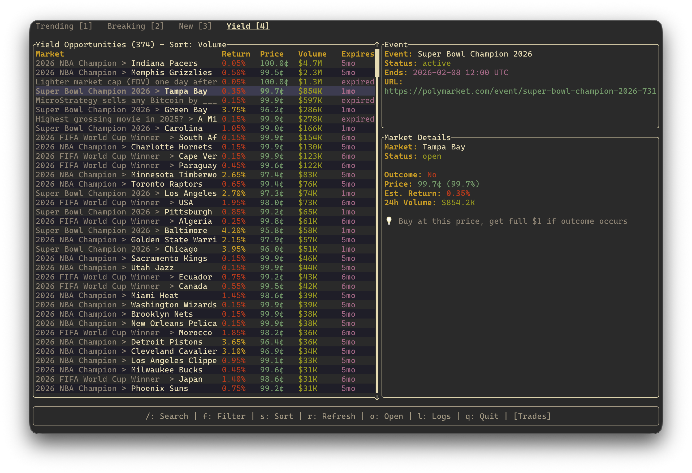

# polymarket-tui

[](https://github.com/penso/polymarket-tui/actions/workflows/ci.yml)
[](https://crates.io/crates/polymarket-tui)

A terminal UI for browsing and monitoring Polymarket prediction markets in real-time. Built in Rust with a beautiful TUI interface.

This was started as a pet project for me to play with AI. This used Cursor, Claude and Codex.



## Features

### Terminal UI (TUI)

- **Multiple tabs**: Events, Favorites, Breaking, and Yield views
- **Events**: All events sorted by 24h trading volume
- **Favorites**: Your bookmarked events (requires authentication)
- **Breaking**: Markets that moved the most in the last 24 hours (shows price change %)
- **Yield**: High-probability markets for yield opportunities

### Live Data

- **Real-time trade monitoring**: Watch live trades via WebSocket (RTDS)
- **Live price updates**: See current prices for all market outcomes
- **Trade counts**: View number of trades per event

### Search & Navigation

- **API search** (`/`): Search all Polymarket events via API
- **Local filter** (`f`): Filter current list locally
- **Keyboard navigation**: Vim-style bindings (`j`/`k`, `↑`/`↓`)
- **Mouse support**: Click to select, scroll panels, switch tabs
- **Panel navigation**: Tab between Events, Details, Markets, Trades, and Logs

### Market Information

- **Event details**: Title, slug, status, end date, tags
- **Market outcomes**: Prices for Yes/No or multiple outcomes
- **Volume indicators**: 24h volume, total volume
- **Status indicators**: Active, closed, in-review states

### Authentication (Optional)

- **CLOB API authentication**: Required for trade counts and favorites
- **Bookmark events**: Save favorite events for quick access
- **User profile**: View your Polymarket profile in the TUI

### Other Features

- **Logs panel**: View API calls and debug info (`l` to toggle)
- **URL opening**: Open event in browser (`o` key)
- **Infinite scroll**: Load more events as you scroll
- **Cache**: Events are cached per tab for fast switching

## Workspace

- `crates/polymarket-api`: Core library with WebSocket client, Gamma API client, CLOB client, and display formatters
- `crates/cli`: Binary application with TUI and CLI commands

## Installation

```bash
cargo install polymarket-tui
```

Or build from source:

```bash
git clone https://github.com/penso/polymarket-tui
cd polymarket-tui
cargo build --release
```

## Usage

### TUI Mode (Recommended)

```bash
# Start TUI (default - no arguments needed)
polymarket-tui

# Or explicitly with options
polymarket-tui trending --order-by volume24hr --limit 100
```

### CLI Commands

```bash
# Watch live trades for a specific event
polymarket-tui watch-event <event-slug-or-url>

# Monitor all markets via WebSocket
polymarket-tui monitor
polymarket-tui monitor --rtds --event <event-slug>

# Get orderbook for a market
polymarket-tui orderbook <market-id>

# Get recent trades
polymarket-tui trades <market-id> --limit 20

# Get event/market information
polymarket-tui event <event-slug>
polymarket-tui market <market-slug>

# Find yield opportunities
polymarket-tui yield --min-prob 0.95 --expires-in 7d
```

## Keyboard Shortcuts

| Key | Action |
|-----|--------|
| `↑`/`k`, `↓`/`j` | Navigate up/down |
| `Tab` | Switch between panels |
| `←`/`→` | Switch tabs |
| `1`-`4` | Jump to tab (Events/Favorites/Breaking/Yield) |
| `Enter` | Toggle live trade watching |
| `/` | Search markets (API) |
| `f` | Filter current list (local) |
| `r` | Refresh current panel |
| `b` | Toggle bookmark (requires auth) |
| `o` | Open event URL in browser |
| `l` | Toggle logs panel |
| `p` | Show user profile |
| `?` | Show help |
| `Esc` | Cancel/close |
| `q` | Quit |

## Authentication (Optional)

For features like favorites and trade counts, set these environment variables:

```bash
export POLYMARKET_API_KEY="your-api-key"
export POLYMARKET_SECRET="your-secret"
export POLYMARKET_PASSPHRASE="your-passphrase"
```

Or create an `auth.json` file (see `envrc-example`).

## Development

```bash
# Build
cargo build

# Run TUI
cargo run -p polymarket-tui -- trending

# Run tests
cargo test

# Run lints
cargo clippy --all-targets --all-features -- -D warnings

# Format code
cargo fmt
```

## API Documentation

The library provides these main modules:

- **`gamma`**: Client for Polymarket's Gamma API (events, markets, user profiles)
- **`clob`**: Client for CLOB API (orderbooks, trades, authentication)
- **`rtds`**: Real-Time Data Stream client for live trade activity
- **`websocket`**: WebSocket client for market updates
- **`display`**: Formatters for colored console output
- **`cache`**: File-based caching for API responses

## CI

GitHub Actions runs on pushes and PRs:

- rustfmt check
- clippy with warnings denied
- full test suite

## License

MIT
